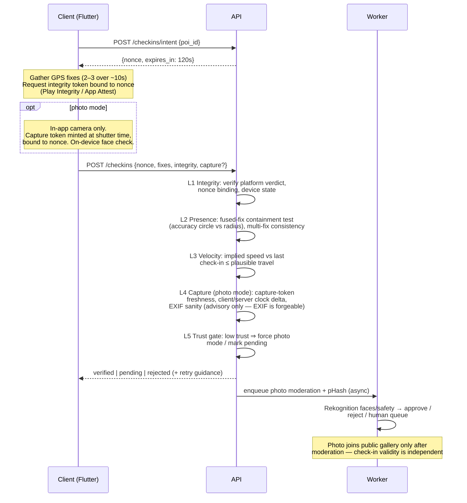

# Wanderpost — Architecture

Status: proposal v1 (pre-MVP). Decisions marked ✅ are agreed; everything else is my
recommendation and open to challenge.

## 1. Stack

### Mobile: Flutter ✅

- Sustained 60fps for the two surfaces that must feel alive: the map and the check-in
  animation. Impeller gives predictable frame times for custom canvas work (postcard
  transitions, marker clustering animations).
- `maplibre_gl` for vector maps (no Google/Mapbox SDK fees), `camera` for in-app live
  capture, `google_mlkit_face_detection` for the on-device person/face first pass.
- Platform channels for the integrity stack: Play Integrity (Android), App Attest +
  DeviceCheck (iOS). These are thin native shims either way; neither framework avoids them.
- The future web map viewer is **not** Flutter Web — it's a separate thin MapLibre JS client
  against the same API. The architecture constraint that matters is a clean HTTP API, which
  we get regardless. **Confirmed, not just theoretical:** `maplibre_gl_web` 0.21.0 (the web
  implementation of our chosen Flutter map package) fails to compile against Flutter 3.44.8
  stable — it calls `ui.platformViewRegistry`, an API current Flutter's web engine no longer
  exposes. Flutter Web was never the plan for the map viewer, and this is a confirmed reason
  it couldn't have been, at least not with this package pairing today.

### Backend: TypeScript API in a container ✅

- **API service:** Node 22 + Fastify + Zod (runtime-validated request/response schemas),
  Drizzle ORM. One deployable container on Fly.io or Cloud Run, horizontally scalable,
  stateless.
- **Database:** managed PostgreSQL 16 + **PostGIS** (Neon, Supabase-as-plain-Postgres, or
  RDS). Geospatial queries (nearby POIs, bbox, dedupe proximity) live in SQL. H3 coverage
  math runs in the app layer via `h3-js` (managed Postgres providers rarely ship `h3-pg`;
  computing cell IDs at write time and storing them as columns is equally fast and portable).
- **Photos:** Cloudflare R2 (S3-compatible, **zero egress fees**) behind Cloudflare CDN with
  image resizing. Clients upload via short-lived presigned URLs; the API never proxies image
  bytes.
- **Async work:** a worker process (same codebase, separate entrypoint) consuming a Postgres
  job queue (`graphile-worker`) for moderation calls, perceptual hashing, leaderboard
  snapshots, and push notifications. No Redis/SQS until scale demands it — fewer moving
  parts at 0→100k.
- **Why containers over serverless:** map browsing produces chatty, latency-sensitive query
  bursts; Lambda + Postgres means connection-pool gymnastics (RDS Proxy et al.) and cold
  starts on the hot path. At 100k users this is 2–4 small containers and a pooled DB —
  boring, cheap, debuggable. Revisit only if traffic becomes extremely spiky.

### Place names & localization

Globally, the map speaks the local language (the Pikmin Bloom model): basemap labels
render native endonyms from the vector tiles' `name` field — Osaka is 大阪市 for everyone —
and POI titles display exactly as their creators wrote them, in any script, never
machine-translated. Only UI chrome localizes to the device language. This keeps the
community map authentic to each place, costs nothing now, and would be painful to retrofit.
Normative details: SPEC §11.

### Third-party services

| Concern | Choice | Notes |
| --- | --- | --- |
| Map tiles | MapLibre + OpenFreeMap (or MapTiler free tier) | Biggest avoided cost. Google/Mapbox SDKs meter per-load and get expensive exactly when the product works. |
| Server-side moderation | AWS Rekognition (faces + moderation labels) | Per-image pricing, no infra. Swap-able behind an interface. Human review queue is our own table + admin page. |
| Push | FCM + APNs directly | No need for a push SaaS at this scale. |
| Payments (post-MVP) | RevenueCat over StoreKit 2 / Play Billing | Receipt validation, restore, family sharing, regional pricing handled; entitlements mirrored server-side via webhook. 1% fee above $2.5k MRR is worth not owning receipt-validation edge cases early. Revisit at scale. |
| Auth | Sign in with Apple, Google, email magic-link | Implemented in our API (JWT access + rotating refresh tokens). Browsing the community map requires no account. |

## 2. Data model

Postgres, PostGIS geography types, H3 cell IDs stored as `bigint` columns.

```
users
  id, handle, email, auth_provider, created_at
  trust_score        smallint (internal, never exposed)
  privacy            jsonb (history visibility, share precision, delayed-visibility window)
  region_code, birth_year_bucket (age gate)

devices
  id, user_id, platform, model
  integrity_state    enum(untested, passed, failed, degraded)
  attest_key_id      text (App Attest key / Play Integrity context)
  first_seen, last_seen

pois
  id, creator_id, title, description, category
  location           geography(Point)        -- canonical position
  h3_r9              bigint                  -- proximity/dedupe bucketing
  checkin_radius_m   int (default 75; category-driven, e.g. viewpoints larger)
  status             enum(active, pending_review, flagged, removed)
  checkin_count      int (denormalized)
  created_at

photos
  id, poi_id, uploader_id
  storage_key, width, height, bytes
  phash              bigint                  -- 64-bit perceptual hash (dedupe)
  source             enum(poi_creation, checkin)
  moderation         enum(pending, approved, rejected, escalated)
  rejection_reason   enum(people, unsafe, quality, other) nullable
  vote_score         int (denormalized)
  exif_summary       jsonb (capture time, device — server-extracted, advisory only)
  created_at

checkins
  id, user_id, poi_id
  mode               enum(photo, confirm)    -- own photo vs existing-photo confirm
  photo_id           nullable FK
  status             enum(verified, pending, rejected, flagged)
  vaulted            boolean                 -- beyond free cap, sealed until entitlement
  h3_r7              bigint                  -- coverage cell
  created_at, verified_at

checkin_evidence      -- one row per check-in; the audit record for "bulletproof proof"
  checkin_id PK
  gps                jsonb (lat, lng, accuracy_m, fix_time, provider)
  distance_m         numeric                 -- to POI center at fix time
  integrity          jsonb (platform verdict, nonce, evaluated_at)
  velocity_check     jsonb (prev checkin id, implied speed, verdict)
  capture            jsonb (photo mode: in-app capture token, client capture time,
                            server receive time, delta)
  verdicts           jsonb (per-layer pass/fail + final)

trust_events
  id, user_id, type (e.g. integrity_fail, teleport, report_upheld, verified_streak)
  delta, metadata, created_at              -- trust_score is a rolling fold of these

user_coverage         -- H3 res-7 cells with ≥1 verified check-in; drives coverage % and leaderboard
  user_id, h3_r7, first_checkin_id, created_at   PK(user_id, h3_r7)

entitlements          -- post-MVP
  user_id, tier, source (apple, google, promo), expires_at, external_ref

votes                 (user_id, photo_id, value)          -- best-postcard surfacing
reports               (id, reporter_id, target_type, target_id, reason, status, resolved_by)
badges                (user_id, badge_key, awarded_at)
health_daily          (user_id, date, steps, distance_m, source)  -- M2, see §9
leaderboard_snapshots (window, scope, scope_key, computed_at, entries jsonb)
```

Key indexes: GiST on `pois.location`; `pois(h3_r9)`; `photos(poi_id, moderation, vote_score)`;
`checkins(user_id, created_at)`; unique `checkins(user_id, poi_id)` (one check-in per POI per
user); `user_coverage(user_id)`.

### H3 resolutions

- **r7 (~5 km² cells)** — coverage and leaderboards. Coarse enough that coverage % feels
  earnable, fine enough that a city has dozens of cells.
- **r9 (~0.1 km²)** — POI proximity bucketing for dedupe candidate lookup (then exact
  PostGIS distance + pHash hamming distance ≤ threshold on candidates).

## 3. API surface (v1)

All endpoints JSON over HTTPS, versioned under `/v1`. Auth via bearer JWT; endpoints marked
🌐 work unauthenticated (read-only map browsing).

```
Auth
  POST /auth/apple | /auth/google | /auth/email/request | /auth/email/verify
  POST /auth/refresh
  POST /devices/attest             -- register device, run platform integrity, store verdict

POIs
  GET  /pois?bbox=&zoom=&category= 🌐   -- clustered at low zoom (server-side clustering)
  GET  /pois/nearby?lat=&lng=      🌐
  GET  /pois/:id                   🌐   -- detail + gallery (approved photos, vote-ranked)
  POST /pois                            -- create: metadata + geo; returns dedupe candidates
                                           if r9-adjacent POI with pHash-similar photo exists
  POST /pois/:id/photos/presign         -- presigned R2 upload for POI-creation photo
  POST /pois/:id/photos/complete        -- finalize; enqueue moderation + pHash

Check-ins  (see pipeline below)
  POST /checkins/intent                 -- { poi_id } → { nonce, expires_in }
  POST /checkins                        -- { nonce, gps fix(es), integrity token,
                                            mode, capture token | photo_ref }
  GET  /checkins/:id                    -- status (verified / pending / rejected)

Me
  GET  /me                              -- profile, counts, trust-gated flags (not the score)
  GET  /me/map                          -- personal map: checked-in, created, vaulted
  GET  /me/coverage                     -- r7 cells + coverage stats
  GET  /me/checkins?cursor=
  POST /me/privacy                      -- visibility, precision, delayed-visibility
  POST /me/export                       -- GDPR export (async job → signed URL)
  DELETE /me                            -- account deletion (grace period, then purge)

Community
  POST /photos/:id/vote
  POST /reports                         -- { target_type, target_id, reason }
  GET  /leaderboards/:board?window=&scope= 🌐

Entitlements (post-MVP)
  POST /webhooks/revenuecat
  GET  /me/entitlements

Admin (separate auth realm)
  GET/POST /admin/moderation/queue, /admin/reports, /admin/pois/:id/status
```

## 4. Verification pipeline ("bulletproof proof")

Honest framing first: **unforgeable location proof does not exist on consumer phones.** A
rooted device with a patched kernel can fake anything. The design goal is layered cost:
make cheating more expensive than traveling, detect it statistically when it happens, and
keep an audit trail (`checkin_evidence`) so leaderboards can be retroactively cleaned.



Layer details:

- **L1 Integrity.** Verdict must be bound to our nonce (prevents replay). Android: Play
  Integrity `MEETS_DEVICE_INTEGRITY`; iOS: App Attest assertion. Emulators/rooted devices →
  reject or degrade to pending + trust event. Devices that can't attest (rare, e.g. no Play
  Services) get a degraded path: check-ins allowed but flagged pending, capped influence on
  leaderboards.
- **L2 Presence.** The client uses the platform **fused location providers** (Android
  FusedLocationProvider, iOS Core Location), never raw GNSS. These already blend GPS,
  Wi-Fi positioning, cell, and sensors — the Skyhook approach, internalized by both
  platforms years ago (Skyhook itself was Apple's Wi-Fi-positioning supplier until iOS
  internalized it; it's now part of Qualcomm). A third-party positioning SDK would add
  licensing cost, an opaque binary, and a privacy story (Wi-Fi scans leaving the device to
  another party) for little gain over the fused fix — so we don't integrate one.
  What we do instead is treat the question probabilistically: the goal is "was the user
  within X of the POI," not "was the fix pinpoint." **Containment test:** accept when the
  fix's accuracy circle sufficiently overlaps the check-in radius — a 60 m-accuracy Wi-Fi
  fix centered 20 m from a POI is a *pass*, not a failure. Hard reject only above a
  sanity ceiling (~150 m accuracy); between clean-pass and ceiling, verify with wider
  tolerance and record the confidence in the evidence. Multiple fixes over ~10 s beat
  one: a spoofed single fix is easy, a consistent short track with plausible jitter is
  harder. All thresholds are per-POI-category (viewpoints get slack; dense-urban POIs get
  the probabilistic path by default).
  *Future evidence layer (post-MVP):* crowdsource per-POI ambient-signal fingerprints
  (Wi-Fi BSSIDs / cell IDs observed by previously verified Android check-ins) as
  corroboration where GNSS is structurally bad — Android only, since iOS doesn't expose
  Wi-Fi scans to apps; anonymized, on-device matching. Noted, not scheduled.
- **L3 Velocity.** Great-circle distance from the user's previous verified check-in over
  elapsed time; threshold ~900 km/h (airliner) with a floor for short gaps. Violations →
  pending + trust event, not silent rejection (flights + clock skew cause false positives).
- **L4 Capture.** For photo check-ins the photo must originate from the in-app camera in
  the current intent window. The capture token is minted client-side at shutter time and
  bound to the nonce; camera-roll ingestion is structurally impossible in this flow (the
  UI for it exists only in POI creation, labeled as such). EXIF is recorded as evidence but
  never trusted as proof.
- **L5 Trust.** `trust_score` folds `trust_events`. Below threshold: existing-photo
  confirms disabled (photo mode required), check-ins land as `pending`, excluded from
  leaderboards until review. Score and thresholds are never shown to users — no oracle for
  attackers to probe.
- **Graceful failure.** Urban canyon / flaky GPS → explicit retry flow ("walk toward open
  sky, we'll keep trying") and a `pending` state that resolves rather than a hard no. The
  moment must never feel like the app calling the user a liar.

## 5. No-people photo policy (hard product rule)

**No photo in Wanderpost ever contains a person.** Postcards are of places. This is a product
identity rule, not just a moderation setting — it's also what makes the photo corpus
privacy-clean (no bystander consent problem, no biometric data, materially lower
GDPR/app-review risk). Enforcement is layered at four points, applying equally to POI
creation and check-in photos:

1. **At capture (on-device, blocking).** ML Kit face detection + pose/person detection run
   on the live camera frame and the captured image. A detected person blocks submission
   with a friendly retake prompt ("someone's in frame — wait for them to pass"). This is
   the primary UX: catch it while the user is still standing there and can retake.
2. **At ingest (server-side, blocking publication).** Rekognition face detection + person
   labels on every upload before the photo is publicly visible. Any detected person →
   `rejected(people)`; borderline signals (distant figures, reflections, statues — statue
   faces are allowed and are a known false-positive class) → human review queue. No photo
   reaches a public gallery without passing this gate.
3. **Community reporting.** "Contains a person" is a first-class report reason on every
   photo; upheld reports generate a trust event for the uploader and feed false-negative
   examples back into threshold tuning.
4. **Periodic re-sweeps.** As detection models improve, re-scan the corpus; quietly
   remove misses.

Check-in semantics when a person is detected: **the check-in never fails because of the
photo.** On-device detection offers retake; if the scene is unavoidably busy, the user can
complete the same check-in in existing-photo confirm mode. A server-side rejection after
the fact removes the photo from the gallery but leaves the verified check-in intact —
gallery admission and presence verification are independent judgments.

`photos.moderation` gains a `rejection_reason` (`people`, `unsafe`, `quality`, `other`) so
the client can explain outcomes and we can measure each gate's hit rate.

## 6. Paywall — Vault model ✅

Check-ins are **never blocked**. Free tier keeps 50 unlocked POIs; beyond that, new
check-ins are fully captured, verified, and counted internally, but appear as **sealed
postcards** on the personal map (`checkins.vaulted = true`). Upgrading unseals everything
instantly — retroactively. Nothing is ever lost; the upgrade moment is "open your vault,"
not "pay to keep playing." Community-map viewing, safety features, and reporting are never
paywalled. Entitlement checks are server-side only.

## 7. Cost strategy (the two big line items)

**Photos.** Client compresses before upload (long edge 2048px, ~85% quality WebP/JPEG,
target ≤ 400KB). Server stores original-as-uploaded plus derived 1024px card and 256px
thumb. R2 zero-egress + Cloudflare resizing means cost is dominated by storage
(~$0.015/GB-mo): 1M photos ≈ 400GB ≈ **$6/month storage** — negligible; the real photo cost
is moderation (~$1–1.5 per 1,000 Rekognition images), which scales with uploads, not views.

**Map tiles.** MapLibre + OpenFreeMap costs $0 at MVP; if reliability demands it, MapTiler
is a modest flat tier. Avoiding per-load Google/Mapbox SDK pricing is the single biggest
cost decision in the app.

## 8. Offline & sync

Check-in intents can't be pre-issued offline (nonce freshness), so the offline story is:
capture everything locally (fixes, photo, timestamps) into a durable outbox, then replay
against `/checkins/intent` + `/checkins` when connectivity returns, within a bounded window
([24h]) and marked as `deferred` evidence — verified server-side with wider tolerance and
lower leaderboard weight. Honest tradeoff: deferred check-ins are weaker proof; the UI says
"synced later" on them.

## 9. Health integration — steps & distance (M2)

A second competitive axis alongside map coverage: how far you actually moved. The point is
motivational — a reason to walk the neighborhood, not just teleport-by-transit between
POIs — and it pairs naturally with streaks and weekly boards.

**Hard constraint: Wanderpost never gathers movement data itself.** No background location, no
pedometer sampling, no motion APIs. We *read* daily aggregates from the platform health
stores — HealthKit (steps, walking+running distance) on iOS, Health Connect on Android —
with explicit opt-in, revocable any time.

- **Data minimization.** Store daily totals only: `health_daily(user_id, date, steps,
  distance_m, source, PK(user_id, date))`. No workouts, no routes, no timestamps finer
  than a day. Sync happens client-side (app reads the store, posts aggregates to
  `POST /me/health/sync`); deletion cascades with the account, and revoking platform
  permission stops the flow at the source.
- **Manual-entry filtering.** Both stores label data provenance (HealthKit
  `wasUserEntered`, Health Connect recording method/origin). We read device-recorded
  entries only — typed-in steps never count.
- **Integrity positioning (my pushback).** Even filtered, health data is far easier to
  fake than a verified check-in, and there's no attestation story for it. So distance/steps
  power the *fun* competitive tier — weekly friends and city boards, streaks, "explorer"
  badges — and stay out of the flagship coverage leaderboard and creator score. The two
  axes are also honest about different things: coverage proves *where you've been*,
  distance celebrates *how you got there*. Anomaly caps (e.g., > 60km walked/day) flag
  rather than rank.
- **Platform compliance.** Apple forbids using HealthKit data for advertising or sharing
  it with third parties; leaderboard use is app functionality under user consent, but the
  consent screen must say exactly what's read, what's shown to whom, and that it's
  droppable. Health data never appears in share cards by default.

## 10. Postcard sending — the growth loop (M2)

A checked-in postcard wants to be *sent* — that's the entire metaphor, and it's the
product's organic growth engine: every send is a personal invite carrying verified
proof-of-place, from someone you know, about a real place. Staged in two steps:

**M2 — send anywhere, no friend graph needed.** After any verified check-in: "Send this
postcard." The card renders photo-front / message-back — stamp with place name + date +
verified mark, a short personal message, sender handle, and photographer credit — and
mints a share image plus an unlisted web link for any messenger. The recipient opens a
beautiful web postcard (the thin web renderer on the public API — its first real job)
with a soft install prompt. No account needed to receive; nothing to configure to send.

**M3+ — in-app postcard inbox** between friends once the friends graph exists (received
postcards become their own collection), and potentially physical print-and-mail as a
premium experiment.

Design guards:

- Only your own check-ins can be sent. Confirm-mode check-ins send the gallery photo with
  the photographer's credit attached — creator recognition travels with every send.
- The back-of-card message is UGC: length-capped, screened by the same automated
  moderation class as other text, report-able from the web view, sender-blockable.
- Privacy: sending is an explicit, per-postcard act that reveals that one place + date to
  the recipient. It never bypasses profile privacy; sender identity is handle only.
- Web postcards are unlisted (unguessable token), non-indexed, and revocable by the
  sender.

## 11. Top 5 risks

1. **Spoofing arms race.** Attested GPS doesn't exist; determined cheaters will land some
   fakes. Mitigation: layered cost (above), immutable evidence trail, statistical detection
   (impossible-pattern sweeps), retroactive leaderboard cleanup, and never publishing which
   layer caught someone.
2. **Cold start.** An empty map kills the loop before it starts. Mitigation: seeded 1–3
   city beta ✅ with 50–100 founder-created POIs per city and creator incentives from day
   one; expand city-by-city only when density holds.
3. **Moderation liability.** User photo uploads mean faces slipping through, copyright
   claims, and worst-case illegal content. Mitigation: on-device pre-check + mandatory
   server-side scan before any photo is public, human escalation queue, hash-matching
   (CSAM) via cloud provider capability before public launch, clear licensing terms at
   upload. This is a launch blocker, not a nice-to-have.
4. **Location privacy / stalking.** Check-in history is a movement diary. Mitigation:
   private-by-default history, delayed public visibility option, precision controls on
   share cards, no "recent visitors" without opt-in, and no background location collection
   at all (also derisks app-store review).
5. **Verification UX killing honest users.** False rejections (urban GPS, old devices,
   clock skew) are more dangerous than false accepts — cheaters cost integrity, but
   rejecting real visitors costs the product's soul. Mitigation: pending-not-rejected
   defaults, generous retry flows, per-category radius tuning, and metrics on
   rejection-rate-by-cause from day one.

## 12. Scale & resilience posture

Designed for 0→100k users on boring, horizontally-scalable infrastructure; every ceiling
beyond that has a named escalation path. Current state:

**Scalable now (implemented):** stateless API — all hot state (nonces, refresh tokens,
codes, rate counters) is hashed rows in Postgres, so any instance serves any request;
photos bypass the API entirely (presigned R2 + CDN); H3/geo math computed at write time
onto indexed columns; UUIDv7 keys for append-friendly indexes; denormalized counters so
read paths never aggregate; leaderboards designed as precomputed snapshots.

**Resilient now (implemented):** `/healthz` serves without a DB and `/readyz` gates
traffic (rolling deploys, LB failover); advisory-locked migrations survive parallel
deploys; atomic nonce consumption and refresh-token family revocation (both covered by
tests); check-in side effects are transactional; verification favors `pending` over data
loss.

**Deferred with a plan:** single Postgres is the ceiling and SPOF — managed HA + PITR at
launch; read replicas for map browsing when reads dominate; time-partition
`checkin_evidence` (append-only, ages to cold storage) when it dominates disk. No cache
tier by design — map reads get CDN/edge caching of clustered tiles, not a Redis to
babysit. Async work moves to the job queue in M1.5. Edge rate-limiting/WAF (Cloudflare)
before public beta.

**Hard requirement before beta (gap today):** metrics + tracing. A verification system
whose false-rejection rate is invisible is broken by definition; the
rejection-rate-by-cause dashboard in M2 depends on this.

## 13. Open questions

- Tier-2 pricing and contents (e.g., $12/yr unlimited + map themes + advanced stats)?
- Age gate: 13 vs 16 per region — need a per-region policy table before public launch.
- Photo licensing wording (platform display license) — needs real legal review pre-launch.
- Which 1–3 seed cities? (Determines beta ops and possibly default map style.)
- Name: ship as "Wanderpost"? (App-store availability check needed.)
