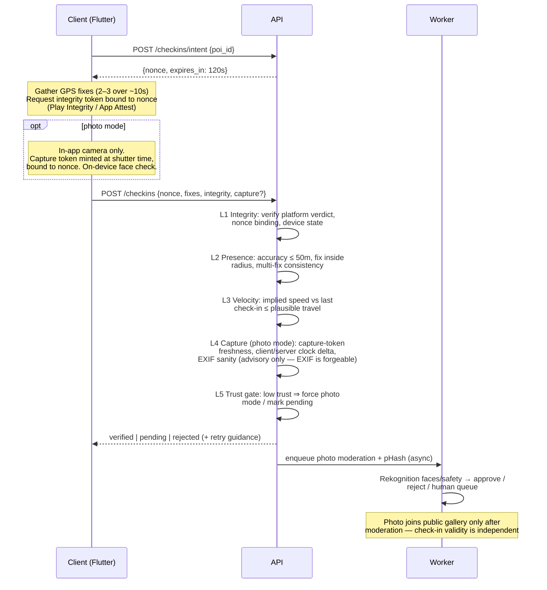

# mapio — Architecture

Status: proposal v1 (pre-MVP). Decisions marked ✅ are agreed; everything else is my
recommendation and open to challenge.

## 1. Stack

### Mobile: Flutter ✅

- Sustained 60fps for the two surfaces that must feel alive: the map and the check-in
  animation. Impeller gives predictable frame times for custom canvas work (postcard
  transitions, marker clustering animations).
- `maplibre_gl` for vector maps (no Google/Mapbox SDK fees), `camera` for in-app live
  capture, `google_mlkit_face_detection` for the on-device person/face first pass.
- Platform channels for the integrity stack: Play Integrity (Android), App Attest +
  DeviceCheck (iOS). These are thin native shims either way; neither framework avoids them.
- The future web map viewer is **not** Flutter Web — it's a separate thin MapLibre JS client
  against the same API. The architecture constraint that matters is a clean HTTP API, which
  we get regardless.

### Backend: TypeScript API in a container ✅

- **API service:** Node 22 + Fastify + Zod (runtime-validated request/response schemas),
  Drizzle ORM. One deployable container on Fly.io or Cloud Run, horizontally scalable,
  stateless.
- **Database:** managed PostgreSQL 16 + **PostGIS** (Neon, Supabase-as-plain-Postgres, or
  RDS). Geospatial queries (nearby POIs, bbox, dedupe proximity) live in SQL. H3 coverage
  math runs in the app layer via `h3-js` (managed Postgres providers rarely ship `h3-pg`;
  computing cell IDs at write time and storing them as columns is equally fast and portable).
- **Photos:** Cloudflare R2 (S3-compatible, **zero egress fees**) behind Cloudflare CDN with
  image resizing. Clients upload via short-lived presigned URLs; the API never proxies image
  bytes.
- **Async work:** a worker process (same codebase, separate entrypoint) consuming a Postgres
  job queue (`graphile-worker`) for moderation calls, perceptual hashing, leaderboard
  snapshots, and push notifications. No Redis/SQS until scale demands it — fewer moving
  parts at 0→100k.
- **Why containers over serverless:** map browsing produces chatty, latency-sensitive query
  bursts; Lambda + Postgres means connection-pool gymnastics (RDS Proxy et al.) and cold
  starts on the hot path. At 100k users this is 2–4 small containers and a pooled DB —
  boring, cheap, debuggable. Revisit only if traffic becomes extremely spiky.

### Third-party services

| Concern | Choice | Notes |
| --- | --- | --- |
| Map tiles | MapLibre + OpenFreeMap (or MapTiler free tier) | Biggest avoided cost. Google/Mapbox SDKs meter per-load and get expensive exactly when the product works. |
| Server-side moderation | AWS Rekognition (faces + moderation labels) | Per-image pricing, no infra. Swap-able behind an interface. Human review queue is our own table + admin page. |
| Push | FCM + APNs directly | No need for a push SaaS at this scale. |
| Payments (post-MVP) | RevenueCat over StoreKit 2 / Play Billing | Receipt validation, restore, family sharing, regional pricing handled; entitlements mirrored server-side via webhook. 1% fee above $2.5k MRR is worth not owning receipt-validation edge cases early. Revisit at scale. |
| Auth | Sign in with Apple, Google, email magic-link | Implemented in our API (JWT access + rotating refresh tokens). Browsing the community map requires no account. |

## 2. Data model

Postgres, PostGIS geography types, H3 cell IDs stored as `bigint` columns.

```
users
  id, handle, email, auth_provider, created_at
  trust_score        smallint (internal, never exposed)
  privacy            jsonb (history visibility, share precision, delayed-visibility window)
  region_code, birth_year_bucket (age gate)

devices
  id, user_id, platform, model
  integrity_state    enum(untested, passed, failed, degraded)
  attest_key_id      text (App Attest key / Play Integrity context)
  first_seen, last_seen

pois
  id, creator_id, title, description, category
  location           geography(Point)        -- canonical position
  h3_r9              bigint                  -- proximity/dedupe bucketing
  checkin_radius_m   int (default 75; category-driven, e.g. viewpoints larger)
  status             enum(active, pending_review, flagged, removed)
  checkin_count      int (denormalized)
  created_at

photos
  id, poi_id, uploader_id
  storage_key, width, height, bytes
  phash              bigint                  -- 64-bit perceptual hash (dedupe)
  source             enum(poi_creation, checkin)
  moderation         enum(pending, approved, rejected, escalated)
  vote_score         int (denormalized)
  exif_summary       jsonb (capture time, device — server-extracted, advisory only)
  created_at

checkins
  id, user_id, poi_id
  mode               enum(photo, confirm)    -- own photo vs existing-photo confirm
  photo_id           nullable FK
  status             enum(verified, pending, rejected, flagged)
  vaulted            boolean                 -- beyond free cap, sealed until entitlement
  h3_r7              bigint                  -- coverage cell
  created_at, verified_at

checkin_evidence      -- one row per check-in; the audit record for "bulletproof proof"
  checkin_id PK
  gps                jsonb (lat, lng, accuracy_m, fix_time, provider)
  distance_m         numeric                 -- to POI center at fix time
  integrity          jsonb (platform verdict, nonce, evaluated_at)
  velocity_check     jsonb (prev checkin id, implied speed, verdict)
  capture            jsonb (photo mode: in-app capture token, client capture time,
                            server receive time, delta)
  verdicts           jsonb (per-layer pass/fail + final)

trust_events
  id, user_id, type (e.g. integrity_fail, teleport, report_upheld, verified_streak)
  delta, metadata, created_at              -- trust_score is a rolling fold of these

user_coverage         -- H3 res-7 cells with ≥1 verified check-in; drives coverage % and leaderboard
  user_id, h3_r7, first_checkin_id, created_at   PK(user_id, h3_r7)

entitlements          -- post-MVP
  user_id, tier, source (apple, google, promo), expires_at, external_ref

votes                 (user_id, photo_id, value)          -- best-postcard surfacing
reports               (id, reporter_id, target_type, target_id, reason, status, resolved_by)
badges                (user_id, badge_key, awarded_at)
leaderboard_snapshots (window, scope, scope_key, computed_at, entries jsonb)
```

Key indexes: GiST on `pois.location`; `pois(h3_r9)`; `photos(poi_id, moderation, vote_score)`;
`checkins(user_id, created_at)`; unique `checkins(user_id, poi_id)` (one check-in per POI per
user); `user_coverage(user_id)`.

### H3 resolutions

- **r7 (~5 km² cells)** — coverage and leaderboards. Coarse enough that coverage % feels
  earnable, fine enough that a city has dozens of cells.
- **r9 (~0.1 km²)** — POI proximity bucketing for dedupe candidate lookup (then exact
  PostGIS distance + pHash hamming distance ≤ threshold on candidates).

## 3. API surface (v1)

All endpoints JSON over HTTPS, versioned under `/v1`. Auth via bearer JWT; endpoints marked
🌐 work unauthenticated (read-only map browsing).

```
Auth
  POST /auth/apple | /auth/google | /auth/email/request | /auth/email/verify
  POST /auth/refresh
  POST /devices/attest             -- register device, run platform integrity, store verdict

POIs
  GET  /pois?bbox=&zoom=&category= 🌐   -- clustered at low zoom (server-side clustering)
  GET  /pois/nearby?lat=&lng=      🌐
  GET  /pois/:id                   🌐   -- detail + gallery (approved photos, vote-ranked)
  POST /pois                            -- create: metadata + geo; returns dedupe candidates
                                           if r9-adjacent POI with pHash-similar photo exists
  POST /pois/:id/photos/presign         -- presigned R2 upload for POI-creation photo
  POST /pois/:id/photos/complete        -- finalize; enqueue moderation + pHash

Check-ins  (see pipeline below)
  POST /checkins/intent                 -- { poi_id } → { nonce, expires_in }
  POST /checkins                        -- { nonce, gps fix(es), integrity token,
                                            mode, capture token | photo_ref }
  GET  /checkins/:id                    -- status (verified / pending / rejected)

Me
  GET  /me                              -- profile, counts, trust-gated flags (not the score)
  GET  /me/map                          -- personal map: checked-in, created, vaulted
  GET  /me/coverage                     -- r7 cells + coverage stats
  GET  /me/checkins?cursor=
  POST /me/privacy                      -- visibility, precision, delayed-visibility
  POST /me/export                       -- GDPR export (async job → signed URL)
  DELETE /me                            -- account deletion (grace period, then purge)

Community
  POST /photos/:id/vote
  POST /reports                         -- { target_type, target_id, reason }
  GET  /leaderboards/:board?window=&scope= 🌐

Entitlements (post-MVP)
  POST /webhooks/revenuecat
  GET  /me/entitlements

Admin (separate auth realm)
  GET/POST /admin/moderation/queue, /admin/reports, /admin/pois/:id/status
```

## 4. Verification pipeline ("bulletproof proof")

Honest framing first: **unforgeable location proof does not exist on consumer phones.** A
rooted device with a patched kernel can fake anything. The design goal is layered cost:
make cheating more expensive than traveling, detect it statistically when it happens, and
keep an audit trail (`checkin_evidence`) so leaderboards can be retroactively cleaned.



Layer details:

- **L1 Integrity.** Verdict must be bound to our nonce (prevents replay). Android: Play
  Integrity `MEETS_DEVICE_INTEGRITY`; iOS: App Attest assertion. Emulators/rooted devices →
  reject or degrade to pending + trust event. Devices that can't attest (rare, e.g. no Play
  Services) get a degraded path: check-ins allowed but flagged pending, capped influence on
  leaderboards.
- **L2 Presence.** Multiple fixes beat one: a spoofed single fix is easy, a consistent
  short track with plausible accuracy jitter is harder. Reject accuracy > 50m (configurable
  per POI category — viewpoints get slack).
- **L3 Velocity.** Great-circle distance from the user's previous verified check-in over
  elapsed time; threshold ~900 km/h (airliner) with a floor for short gaps. Violations →
  pending + trust event, not silent rejection (flights + clock skew cause false positives).
- **L4 Capture.** For photo check-ins the photo must originate from the in-app camera in
  the current intent window. The capture token is minted client-side at shutter time and
  bound to the nonce; camera-roll ingestion is structurally impossible in this flow (the
  UI for it exists only in POI creation, labeled as such). EXIF is recorded as evidence but
  never trusted as proof.
- **L5 Trust.** `trust_score` folds `trust_events`. Below threshold: existing-photo
  confirms disabled (photo mode required), check-ins land as `pending`, excluded from
  leaderboards until review. Score and thresholds are never shown to users — no oracle for
  attackers to probe.
- **Graceful failure.** Urban canyon / flaky GPS → explicit retry flow ("walk toward open
  sky, we'll keep trying") and a `pending` state that resolves rather than a hard no. The
  moment must never feel like the app calling the user a liar.

## 5. Paywall — Vault model ✅

Check-ins are **never blocked**. Free tier keeps 50 unlocked POIs; beyond that, new
check-ins are fully captured, verified, and counted internally, but appear as **sealed
postcards** on the personal map (`checkins.vaulted = true`). Upgrading unseals everything
instantly — retroactively. Nothing is ever lost; the upgrade moment is "open your vault,"
not "pay to keep playing." Community-map viewing, safety features, and reporting are never
paywalled. Entitlement checks are server-side only.

## 6. Cost strategy (the two big line items)

**Photos.** Client compresses before upload (long edge 2048px, ~85% quality WebP/JPEG,
target ≤ 400KB). Server stores original-as-uploaded plus derived 1024px card and 256px
thumb. R2 zero-egress + Cloudflare resizing means cost is dominated by storage
(~$0.015/GB-mo): 1M photos ≈ 400GB ≈ **$6/month storage** — negligible; the real photo cost
is moderation (~$1–1.5 per 1,000 Rekognition images), which scales with uploads, not views.

**Map tiles.** MapLibre + OpenFreeMap costs $0 at MVP; if reliability demands it, MapTiler
is a modest flat tier. Avoiding per-load Google/Mapbox SDK pricing is the single biggest
cost decision in the app.

## 7. Offline & sync

Check-in intents can't be pre-issued offline (nonce freshness), so the offline story is:
capture everything locally (fixes, photo, timestamps) into a durable outbox, then replay
against `/checkins/intent` + `/checkins` when connectivity returns, within a bounded window
([24h]) and marked as `deferred` evidence — verified server-side with wider tolerance and
lower leaderboard weight. Honest tradeoff: deferred check-ins are weaker proof; the UI says
"synced later" on them.

## 8. Top 5 risks

1. **Spoofing arms race.** Attested GPS doesn't exist; determined cheaters will land some
   fakes. Mitigation: layered cost (above), immutable evidence trail, statistical detection
   (impossible-pattern sweeps), retroactive leaderboard cleanup, and never publishing which
   layer caught someone.
2. **Cold start.** An empty map kills the loop before it starts. Mitigation: seeded 1–3
   city beta ✅ with 50–100 founder-created POIs per city and creator incentives from day
   one; expand city-by-city only when density holds.
3. **Moderation liability.** User photo uploads mean faces slipping through, copyright
   claims, and worst-case illegal content. Mitigation: on-device pre-check + mandatory
   server-side scan before any photo is public, human escalation queue, hash-matching
   (CSAM) via cloud provider capability before public launch, clear licensing terms at
   upload. This is a launch blocker, not a nice-to-have.
4. **Location privacy / stalking.** Check-in history is a movement diary. Mitigation:
   private-by-default history, delayed public visibility option, precision controls on
   share cards, no "recent visitors" without opt-in, and no background location collection
   at all (also derisks app-store review).
5. **Verification UX killing honest users.** False rejections (urban GPS, old devices,
   clock skew) are more dangerous than false accepts — cheaters cost integrity, but
   rejecting real visitors costs the product's soul. Mitigation: pending-not-rejected
   defaults, generous retry flows, per-category radius tuning, and metrics on
   rejection-rate-by-cause from day one.

## 9. Open questions

- Tier-2 pricing and contents (e.g., $12/yr unlimited + map themes + advanced stats)?
- Age gate: 13 vs 16 per region — need a per-region policy table before public launch.
- Photo licensing wording (platform display license) — needs real legal review pre-launch.
- Which 1–3 seed cities? (Determines beta ops and possibly default map style.)
- Name: ship as "mapio"? (App-store availability check needed.)
